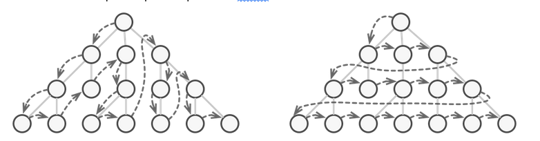
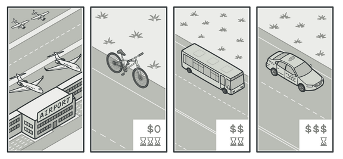
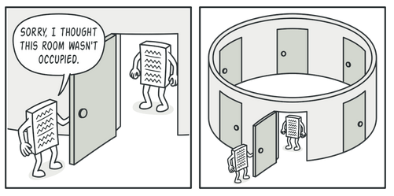
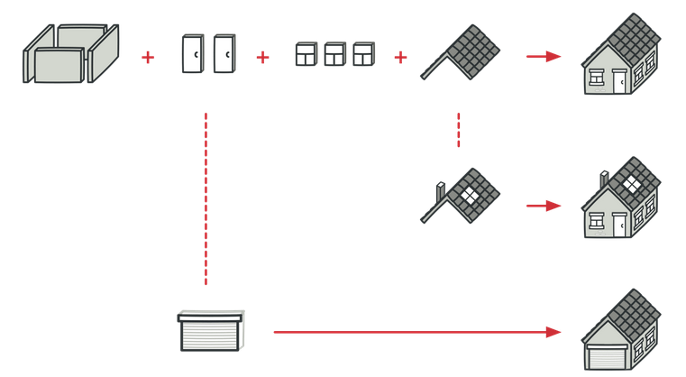
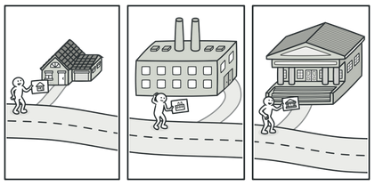
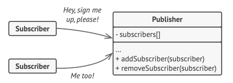
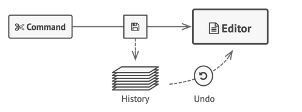
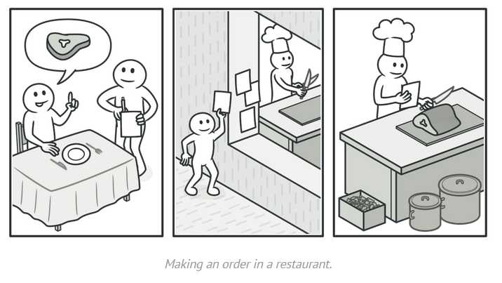

# Design Patterns

# Index
   - [Iterator](#iterator)
   - [Strategy](#strategy)
   - [Singleton](#singleton)
   - [TemplateMethod](#template-method)
   - [Visitor](#visitor)
   - [Observer](#observer)
   - [Memento](#memento)
   - [Mediator](#mediator)
   - [Command](#command)
   
   

## Introduction

As this task statement suggest, this weeks document will go trough the patterns we decided that are a good adition to our proyect, a extract from the Design Patterns (1994) book says:

>*"Design patterns help you choose design alternatives that make a system reusable and avoid alternatives that compromise reusability, they can even improve documentation and maintenance."*

So basically by using design patterns we make it easier to reuse deigns and architectures, using proven techniques.
just like the book references, using Alexanders analogy for building patterns, we can applly the same way of thinking into our problems and structures in coding.

>*"Each pattern describes a problem wich occur over and over again In our enviroment, and then describes the core solution to that problem, in such a way that you can use this solution a million times over, without ever doing it the same way twice" [AIS 77, page x]*
                            -Christopher Alexander

So with the introduction out of the way, we can express using our knowledge why we have choosen the following patterns as a good solution or abstraction to our code, making it easier to document and improve in the future.

---------------------------------------

## Iterator 

>*The same collection can be traversed in several different ways.*

The idea behind using iterator *(wich by the way is actually implemented in java itslef)* is to create a dinamic pattern to randomize the order of the cards. we could think of the deck as a stack of cards. and the iterator will make a route to go to the next card, have different ways of taking a card out the deck and also putting a card back on it.

----------------------------------------

## Strategy

>*“Various strategies for getting to the airport.”*

Without this pattern, assigning difficulty levels to bots would be complicated. Requiring direct changes to the code and leading to a difficult-to-maintain architecture.

In case of bots, the Strategy pattern provides a solution by defining a common interface for all difficulty strategies. Each bot interacts with these strategies through the interface, allowing easy incorporation of new strategies without modifying existing code. This facilitates the dynamic adjustment of bot behavior during the game according to the chosen difficulty level, promoting cohesion and code reuse.

----------------------------------------

## Singleton

>*“Clients may not even realize that they’re working with the same object all the time.”*

We have thought of making different classes a singleton, but we also have discussed about having these specific classes to be ***static***, this will be explained later on but by using singleton we just make an object be the same instance, we thought about having the following
- Dice:
    - The dice will be the same for all matches, this wont have any effect in any games playthorugh

- Board
    - The board has been thought to be a sum of every ambience arround the game, making it easy for players to use the same board, **since** the board doesnt **store** data, we could tecnically have one implementation across all matches.
- Cards
    - Same as the board, cards are unique, while the **deck** is not, each card is inside a deck, but these deck depend on the game, while as cards are only for a game deck to use and ***shuffle***, we could also implement one card for many **game decks**.

_Or we could think of these as static classes, its all up to debate at this point._

----------------------------------------

## Template Method

>*“A typical architectural plan can be slightly altered to better fit the client’s needs.”*

We could use the template method with the base class "Player", defining common methods for both users and bots, and allowing the subclasses "User" and "Bot" to implement their own additional behavior.

Also, the template method could be applied to manage the different types of squares on the board. The base class "Square" would establish abstract methods that subclasses, such as "Deck", "Property", and "Tax", would implement according to the type of square. For example, the "event()" method of "Square" could trigger specific actions when a player lands on a square, such as buying a property or paying taxes, providing an organized and flexible structure for game management.

----------------------------------------

## Visitor

>*“A good insurance agent is always ready to offer different policies to various types of organizations.”*

The visitor could help us manage an event of falling into a arrange of diferent squares as a player, so basically as a player we have different options that are defined with which square we landed on, thats where the visitor pattern comes to use, making us act a diferent way, depending on were we are.

----------------------------------------

## Observer

>*“A subscription mechanism lets individual objects subscribe to event notifications."*

The pattern observer could help us get a notification for every event that is taking place in the board. every square could have attributes and behaviors, so via what the observer pattern implies, basically a subscription method of adding as many squares as we have, we could get notified as a player of everything going on in the game, this could potentially be a huge part of the game, taking out a big ammount of classes and composition, however its still being evaluated by our members wherever we decide to implement this pattern or not.

----------------------------------------

## Memento

>*“Before executing an operation, the app saves a snapshot of the objects’ state, which can later be used to restore objects to their previous state.”*

**Saving the state of the game, and sending it to the server**, this pattern will help us take a snapshot of the game and save it, making it easy for us to reload later to a previus state of the game while we constantly saving again and again.

Basically we will send this information to the database to make an *auto-save*

----------------------------------------

## Mediator

This is the logic behind the game, we see from a perspective of the analogy that:

>*“Aircraft pilots don’t talk to each other directly when deciding who gets to land their plane next. All communication goes through the control tower.”*

So, mediator will be a pattern that helps players go through the game itself, will be the one making out the rules, and managing who plays and at what instance.

We could also use ***mediator*** to manage **transactions** inside the game, basically implement this on the bank class.

----------------------------------------

## Command

>*Making an order in a restaurant.*

In the game, the *"Command"* pattern would be useful for the **Banco** class, as it would be responsible for managing the financial transactions that occur during the game. By *encapsulating* each type of transaction as a command object, the Banco can issue requests to execute specific actions, such as buying or selling properties, paying taxes, collecting rent, or facilitating transactions between players, providing a clear separation between the request and the execution of financial actions.

In the book, we can make a small reference to the **"Aspects that can vary"** of every design pattern, when we take a look at Command, we get:

>*"when and how a request is fulfilled."*

We could think of this as a way of describing an **auction** wich is also a part of the game, the beginning and end of an auction could be designed using this command pattern.